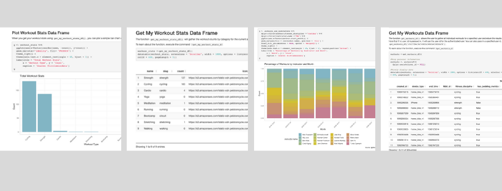

# Welcome to pelotonR

# About the Package

The pelotonR package was created to provide users with simple access to the Peloton API through R.  

The Peloton APIs are unsupported.  However, [there are some really great unofficial swagger docs](https://app.swaggerhub.com/apis/DovOps/peloton-unofficial-api/0.2.3) which I used to familiarize myself with the API.

 

The package offers a set of easy to use functions which allow the user to:
	
* Pull general Peloton data in a variety of formats
* Authenticate with the Peloton API
* Pull user specific data in a variety of formats when authenticated.
* Gather full data sets in one function call without having to handle paged API calls.
* Gather joined data sets in one function call.

 

# Getting Started

### 1) Please install the package
 
<code> devtools::install_github("lgellis/pelotonR")</code>
 
 
### 2) Please check out the [pelotonR getting started guide](https://lgellis.github.io/pelotonR/)
 

### 3) Check out two great tutorials using the package
 - ["A Peloton Data Tribute to my Wife"](https://dustysturner.com/post/the-peloton-api-part-2/) By [Dusty Turner](https://dustysturner.com/post/the-peloton-api-part-2/)
 - ["My Peloton Instructors"](https://twitter.com/tanya_shapiro/status/1478751309482311681), with code posted [here](https://github.com/tashapiro/TidyTuesday/blob/master/2022/W1/instructor-summary.R) by [Tania Shapiro](https://twitter.com/tanya_shapiro)
