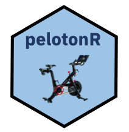

```{r setup, include=FALSE}
knitr::opts_chunk$set(echo = TRUE)
```



# About the Package

The pelotonR package was created to provide users with simple access to the Peloton API through R.  

The Peloton APIs are unsupported.  However, [there are some really great unofficial swagger docs](https://app.swaggerhub.com/apis/DovOps/peloton-unofficial-api/0.2.3) which I used to familiarize myself with the API.

<br/>

The package offers a set of easy to use functions which allow the user to:
	
* Pull general Peloton data in a variety of formats
* Authenticate with the Peloton API
* Pull user specific data in a variety of formats when authenticated.
* Gather full data sets in one function call without having to handle paged API calls.
* Gather joined data sets in one function call.

# Load the Libraries

Before we start exploring the pelotonR package, we will load a few libraries used to help explore and display the data.

```{r echo=TRUE, message=TRUE}
library("pelotonR")
#Packages for nice output display
library(DT) # For table display
library(Hmisc) # For list display
library(tidyverse) # For data munging
library(gameofthrones) # For colors
```

# Unauthenticated API Calls

The following functions are available without authentication.  

## Get Peloton Metadata Mappings Data Frame

The function `get_metadata_mapping_df(type)` allows us to see all metadata mapping for a particular category of Peloton metadata. Available options for `type` include: 'instructors', 'class_types', 'equipment', 'fitness_disciplines', device_type_display_names', 'content_focus_labels', 'difficulty_levels', 'locales'

To learn about the function, execute the command `?get_metadata_mapping_df`

```{r}
class_types <- get_metadata_mapping_df('class_types')

#Nicely display data
datatable(class_types, extensions = "Scroller", width = 1000, options = list(scrollY = 400, scroller = TRUE, scrollX = 600, pageLength = 5))
```


## Get Peloton Live Rides Data Frame

The function `get_live_rides_df` returns a data frame with all of the currently available live rides.

To learn about the function, execute the command `?get_live_rides_df`

```{r}
live_rides <- get_live_rides_df()

#Nicely display data
datatable(live_rides, extensions = "Scroller", width = 1000, options = list(scrollY = 400, scroller = TRUE, scrollX = 600, pageLength = 5))
```


## Get Full Set of Ride Information In a List

The function `get_ride_info_list` allows us to gather the full list of information for a particular ride. 

To learn about the function, execute code `?get_ride_info_list`

```{r, max.height='100px'}
ride_info <- get_ride_info_list('55214456a1984c5885a087021e3f67b7')

#Nicely display data
list.tree(ride_info)
```

## Get Peloton Ride Data Frame

The function `get_ride_info_df` allows us to gather the basic ride information for a particular ride into a data frame.

To learn about the function, execute the command `?get_ride_info_df

```{r paged.print=TRUE}
ride_info <- get_basic_ride_info_df('55214456a1984c5885a087021e3f67b7')

#Nicely display data
datatable(ride_info, extensions = "Scroller", width = 1000, options = list(scrollY = 75, scroller = TRUE, scrollX = 600, pageLength = 5))
```

## Get Peloton Instructors Data Frame

The function `get_instructors_df` returns a data frame with all instructors and their information.

To learn about the function, execute the command ?get_instructors_df`


```{r}
instructors <- get_instructors_df()

#Nicely display data
datatable(instructors, extensions = "Scroller", width = 1000, options = list(scrollY = 400, scroller = TRUE, scrollX = 600, pageLength = 5))
```


## Get Live Rides and Details

The function `get_live_ride_and_details_df` returns a data frame with all current live rides as well as the joined ride and instructor data for each ride. 

To learn about the function, execute the command `?get_live_ride_and_details_df`


```{r}
live_with_details <- get_live_ride_and_details_df() 

#Nicely display data
datatable(live_with_details, extensions = "Scroller", width = 1000, options = list(scrollY = 400, scroller = TRUE, scrollX = 600, pageLength = 5))
```

### Plot Ride Data

Now that we have a data frame with all live rides and their metadata, we will do a simple plot to display some of the details of the live rides available.  In this example, we are plotting the count of live rides by instructor. 

```{r fig.width=10,fig.height=10}

p <- live_with_details %>%
  dplyr::group_by(instructor.name) %>%
  dplyr::summarize(N = length(instructor.name)) %>% 
  dplyr::filter(instructor.name !='NA') %>% 
  ggplot(aes(y=reorder(instructor.name, N), N) ) + 
  geom_bar(stat = "identity", fill= "#82B5C4") + 
  theme_light() + 
  theme(axis.text.x = element_text(angle = 45, hjust = 1), legend.position="bottom") +
  labs(title = "Current Live Rides Available by Instructor",
       x = "Total Rides", y = "Instructor", 
       caption = 'Source: @littlemissdata')
p
```


# Authenticate with Peloton

The function `authenticate(username, password)` allows the user to authenticate with the Peloton API.  In this function you are able to pass in your `username` and `password`.  If you pass in no value, the system will prompt you for a user name and password.


To learn about the function, execute the command `?authenticate`

```{r}
auth_response <-authenticate()
head(summary(auth_response))
```


# Authenticated API Calls

The following functions are only available after the user has authenticated with the Peloton API.  Authentication is easily done by calling the `authenticate()` function documented above.


## Get My Workout Stats Data Frame

The function `get_my_workout_stats_df()` will gather the workout counts by category for the current authenticated user. 


To learn about the function, execute the command `?get_my_workout_stats_df`

```{r}
workout_stats <-get_my_workout_stats_df()
datatable(workout_stats, extensions = "Scroller", width = 1000, options = list(scrollY = 400, scroller = TRUE, scrollX = 600, pageLength = 5))
```


### Plot Workout Stats Data Frame

When you get your workout stats using `get_my_workout_stats_df()`, you can plot a simple bar chart with ggplot2.  
```{r fig.width=10,fig.height=5}
g <- workout_stats %>%
  ggplot(aes(x=factor(reorder(name, -count)), y=count)) +
  geom_bar(stat="identity", fill= "#82B5C4") +
  theme_light() + 
  theme(axis.text.x = element_text(angle = 45, hjust = 1)) +
  labs(title = "Total Workout Stats",
       x = "Workout Type", y = "Count",
       caption = 'Source: @littlemissdata') 
g
```


## Get My Stats List

The function `get_my_stats_list()` will gather all stats for the current authenticated user and return the results in a list.

To learn about the function, execute the command `?get_my_stats_list`

```{r}
stats <-get_my_stats_list()
head(summary(stats))
```

## Get My Workouts Data Frame

The function `get_workouts_df()` allows the user to gather all individual workouts for a specified user and return the results in a data frame. Note that if no user_id is passsed in, it will use the user id for the authenticated user.  You can also pass in a specified user id.  For example: `get_workouts_df('n7u2739e18a7496fa146b3a42465da78')`.

To learn about the function, execute the command `?get_workouts_df`

```{r}
workouts <-get_workouts_df()  

#Drop personal information
workouts <- workouts%>% 
  dplyr::mutate(user_id = NULL)

#Nicely display data
datatable(workouts, extensions = "Scroller", width = 1000, options = list(scrollY = 400, scroller = TRUE, scrollX = 600, pageLength = 5))
```


## Get My Workouts with Instructor Information Data Frame

The function `get_workouts_and_instructors_df()` allows the user to gather all individual workouts and all related instructor data for a user and return it in a data frame. If a user id is not passed into the function, it will return the current users workouts.

To learn about the function, execute the command `?get_workouts_and_instructors_df`

```{r}
workouts_and_instructors <-get_workouts_and_instructors_df()

#Drop personal information
workouts_and_instructors <- workouts_and_instructors%>% 
  dplyr::mutate(workout.user_id = NULL)

#Nicely display data
datatable(workouts_and_instructors, extensions = "Scroller", width = 1000, options = list(scrollY = 400, scroller = TRUE, scrollX = 600, pageLength = 5))
```


### Plot Workout Data Frame

When you get your workout stats, you can plot a simple progress line chart with ggplot2.  The color palette is from the fabulous [game of thrones package](https://github.com/aljrico/gameofthrones) by [Alejandro Jiménez](https://twitter.com/aljrico).


```{r fig.width=10,fig.height=5}
p <- workouts_and_instructors %>%
  dplyr::group_by(workout.start_month, workout.fitness_discipline) %>%
  dplyr::summarize(N = length(workout.fitness_discipline)) %>% 
  ggplot(aes(x=workout.start_month, y=N, color=workout.fitness_discipline) ) + 
  geom_line() + 
  scale_fill_got(discrete = TRUE, option = "Margaery") +
  theme_light() + 
  theme(axis.text.x = element_text(angle = 45, hjust = 1), legend.position="bottom") +
  labs(title = "Workout by Month and Fitness Discipline",
       x = "Month", y = "Total Workouts", 
       caption = 'Source: @littlemissdata')
p
```


We can also create a 100% stacked bar chart with the breakdown in percentage of workouts by instructor and month.  


```{r fig.width=10,fig.height=7}
g <- workouts_and_instructors %>%
  dplyr::filter(workout.fitness_discipline =='cycling') %>% 
  dplyr::filter(instructor.name !="NA") %>% 
  ggplot(aes(x=factor(workout.start_month))) +
  geom_bar(aes(fill = instructor.name), position = 'fill') +
  scale_fill_got(discrete = TRUE, option = "Margaery") +
  theme_light() + 
  theme(axis.text.x = element_text(angle = 45, hjust = 1), legend.position="bottom") +
  labs(title = "Percentage of Workouts by Instructor and Month",
       x = "Month", y = "Count",
       caption = 'Source: @littlemissdata') 
g

```


# Thank You

Thank you for trying out my pelotonR package!  If like the package, please share your results with me on [twitter](https://twitter.com/littlemissdata)!

